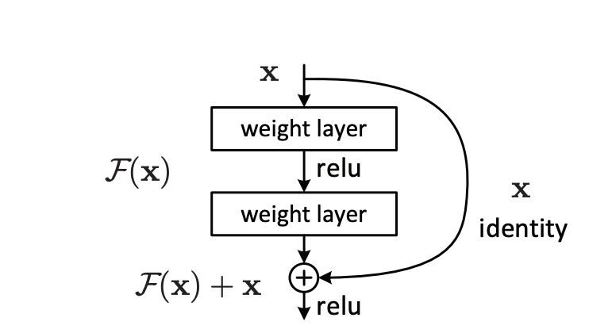

# ResNet

English | [简体中文](./README_cn.md)

   * [ResNet](#resnet)
      * [1 Introduction](#1-introduction)
      * [2 Dataset](#2-dataset)
      * [3 Environment](#3-environment)
      * [4 Quick Start](#4-quick-start)
      * [5 Model Information](#5-model-information)
      * [6 Customization](#6-customization)

## 1 Introduction

ResNet (Residual Neural Network) was come up with by four Chinese people from Microsoft Research, including Kaiming He. They evaluated residual nets with a depth of up to 152 layers through ResNet Unit, and carried out the first prize in ILSVRC2015. On the ImageNet test set, their ensemble had 3.57% top-5 error, and had lower complexity than VGGNet. This model is highly efficient. 

The  reference is [Deep Residual Learning for Image Recognition](https://arxiv.org/abs/1512.03385).

## 2 Dataset

The dataset is: [Flowers](https://www.robots.ox.ac.uk/~vgg/data/flowers/).

- The size of dataset: There are 102 categories, and 8189 images are of 32*32 pixels in width and height
  - Training set: 1020 images
  - Validation set: 1020 images
  - Test set: 6149 images
- The format of data: When you apply the PaddlePaddle’s built-in dataset—[Flowers](https://www.robots.ox.ac.uk/~vgg/data/flowers/), the default format is ``numpy.array``. For more details, please refer to [paddle.vision.datasets.Flowers](https://www.paddlepaddle.org.cn/documentation/docs/zh/api/paddle/vision/datasets/flowers/Flowers_cn.html).

## 3 Environment

- Hardwares: XPU, GPU, CPU

- Framework: 
  - PaddlePaddle >= 2.0.0

## 4 Quick Start

You can refer to [PaddleDetection](https://github.com/PaddlePaddle/PaddleDetection) to check the process of realizing this model. Please refer to [Quick Start](https://github.com/PaddlePaddle/PaddleDetection/blob/release/2.0-rc/docs/tutorials/QUICK_STARTED_cn.md) to begin the journey. The address of this model's source document is [resnet.py](https://github.com/PaddlePaddle/PaddleDetection/blob/release/2.0-rc/ppdet/modeling/backbones/resnet.py#L39).

## 5 Model Information

Please refer to the following list to check other models’ information:

| Information Name         | Description                                                  |
| --- | --- |
| Announcer | PaddlePaddle |
| Time | 2021.03 |
| Framework Version | Paddle 2.0.1 |
| Application Scenario     | Image Classification                                         |
| Supported Hardwares      | XPU, GPU, CPU                                                |
| TOP-1 Error              | 22.44                                                        |
| TOP-5 Error              | 6.21                                                         |
| Download Links           | [Pre-trained Models]() \| [Training Log]() \| [vdl]()        |
| Benchmark                | [benchmark](https://github.com/PaddlePaddle/benchmark/tree/master/dynamic_graph/resnet/paddle) |
| Mixed-precision Training | [resnet(amp)]()                                              |
| Source Code of ResNet    | [ResNet](https://github.com/TCChenlong/models/blob/update_readme/dygraph/resnet/train.py#L270) |
| Online Running           | [Use ResNet50 to Realize Image Classification]()             |

## 6 Customization

Please refer to [the passage](#) to customize the models.
